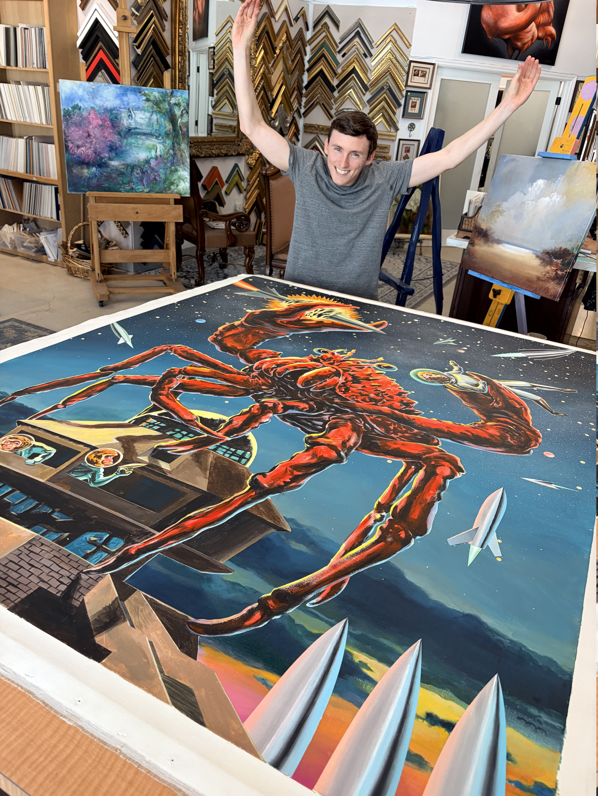
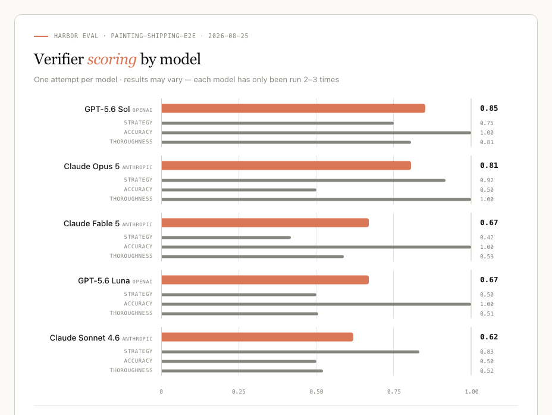
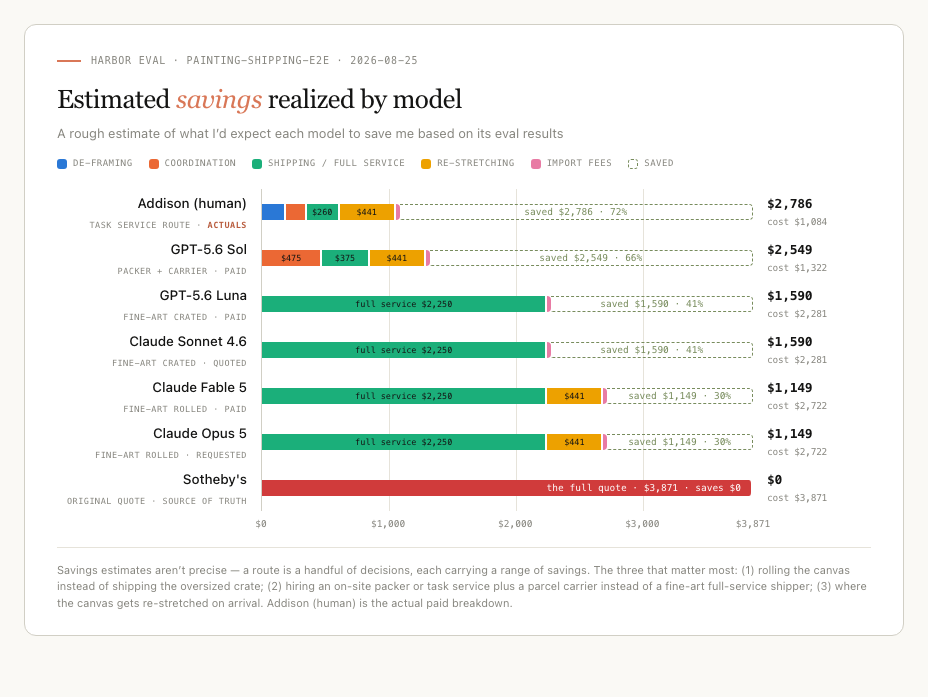

# Are personal AI assistants actually valuable?

Every day, we make decisions about what to buy and how much to pay.

Analyzing every purchase to find the right balance of cost, quality, and convenience is exhausting. Everyone has a price point where convenience stops feeling worth it. Agents can take on that work, finding better deals and saving us money, as long as they think critically and creatively instead of defaulting to the easiest option, like their human counterpart (me).

## Inspo

Recently, I unexpectedly won an absurdly large acrylic painting of a king crab at auction. Exciting!



What wasn’t exciting was the $3.6K shipping quote I received from Sotheby’s Hong Kong. No surprise, shipping a 5' × 4' crate across the world is expensive 😅. Unwilling to pay twice the cost of the painting itself, I decided to get creative.

- Maybe Sotheby's is just price gouging? Turns out an oversized crate really does cost $1.5-3K to ship by air.
- Maybe we can put it on an actual ship? Nope, still expensive and more of a hassle!
- Aha, what if we take it off the stretcher and roll it into a tube? Sotheby’s confirmed it was possible. Now we’re talking!

Sotheby's came back with a quote to de-stretch and ship the painting rolled for $2,351. 

Still way too much given FedEx/DHL only $300-400 for the transport. So I tried to convince Sotheby's to take my label... No luck. 
My final option was to find another individual/company to handle pickup, packing, and shipping out the painting. Probably 1-2 hours of work tops.
Unfortunately, Claude kept recommending fine-art shippers quoting $1.8K at best.

Finally, I started looking at task services in Hong Kong. 

Surely someone would take care of this for $100-$300. After some quick research, I landed on Zerrand. What a pleasant surprise. They handled all the coordination for under $200 and even found me a cheaper shipping rate of $260.

### The End Result

#### Original Quote


| Item     | Cost          |
| -------- | ------------- |
| Shipping | **$3,870.86** |


#### What I Paid


| Item          | Cost          |
| ------------- | ------------- |
| De-stretching | $191.30       |
| Task service  | $160.64       |
| Shipping      | $260.44       |
| Import fees   | $31.00        |
| Re-stretching | $441.00       |
| **Total**     | **$1,084.38** |


> The re-stretching was done by my family’s preferred framer. I could have easily saved another $200 here.

#### Total Savings

**$2,786.48, or 72%**

I spent several hours coordinating all the logistics. This is exactly the kind of work agents should be able to handle reliably from start to finish. This eval tests whether standard agent harnesses can manage a real-world scenario like this end to end.

A few observations from running the eval (which aren't perfect):

- Stronger models identify creative strategies, but still rely on obvious search results instead of finding a diverse set of vendors that can cheaply handle packing and shipping.
- Agents often assume DHL or FedEx can collect directly from Sotheby’s. In practice, Sotheby’s will not prepare the package, label, or customs paperwork, and the carrier will not do it at pickup. The route requires an intermediary to prepare the shipment and coordinate the handoff (which is a stupid reality).

## Eval suite

I used Harbor Framework to construct the simulated tasks

### Available Tasks

I started by breaking the larger logistics challenge into independently gradable stages:

1. **[Strategy](recipes/painting-shipping-1-strategy/README.md)**
  Identifies and prioritizes distinct shipping strategies, including realizing that the painting does not need to remain crated.
2. **[Company Research](recipes/painting-shipping-2-companies/README.md)**
  Finds a diverse set of providers capable of supporting rolled or crated shipping.
3. **[Quote Comparison](recipes/painting-shipping-3-quotes/README.md)**
  Uses the selected route and company list to request quotes and identify the best option, with an emphasis on price.
4. **[End-to-End Shipping](recipes/painting-shipping-e2e/README.md)**
  Runs the full scenario in one prompt and trajectory, covering strategy, company research, quote outreach, payment, and collection confirmation. The stage 1 through 3 criteria are graded as hidden subgoals.

### Benchmark

Latest end-to-end results under the rebuilt band-based verifiers and agentic
judge (freshest complete run per model, 2026-08-25):



Verifier scoring measures process quality; the chart below estimates what each
model's chosen route would actually save:




### Running the tasks

Copy the environment template, add `ANTHROPIC_API_KEY` to the gitignored `.env`,
then set up the repository:

```bash
cp .env.example .env
uv sync
source .venv/bin/activate
```

Run the end-to-end single-trajectory task once with Sonnet:

```bash
.venv/bin/harbor job start --env-file .env \
  -p recipes/painting-shipping-e2e \
  -a claude-code -m anthropic/claude-sonnet-4-6 \
  --n-attempts 1 --n-concurrent 1 \
  --job-name painting-shipping-e2e-sonnet
```

Run an isolated stage when diagnosing a specific capability:

```bash
.venv/bin/harbor job start --env-file .env -p recipes/painting-shipping-1-strategy \
  -a claude-code -m anthropic/claude-sonnet-4-6 --n-attempts 1 \
  --job-name painting-strategy
```

The tasks use RewardKit LLM judges and start in Harbor's automatically collected
`/logs/artifacts` directory. LLM-judge scores are intentionally not exact
deterministic assertions.

### Other documentation

A reusable, seedable SMS and email MCP primitive lives in
`[primitives/communications](primitives/communications/README.md)`. Every task owns
its seed files, sidecar context, and action vocabulary under its `world/` folder. A
task seed can be inspected with:

```bash
python primitives/communications/inspect_seed.py recipes/painting-shipping-1-strategy/world/communications/email.json
```